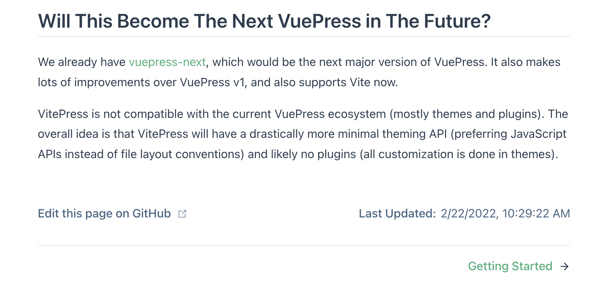

## 一切的开始

一切开始于我想「搭建一个技术博客」的想法，于是前思后想，顺便尝试了许多技术组合后，最终选择了使用vuepress。

不过最开始其实我并没有打算直接使用vuepress，而是想使用vitepress^[[https://vitepress.vuejs.org/](https://vitepress.vuejs.org/)]。究其原因，主要是因为vuepress是使用webpack-dev-server，而我更想多接触接触vitejs。

然后，我就在vitepress的文档页中看到了如下说明：



我：地铁、老人、手机.jpg

嘛不过既然vuepress有默认基于vitejs的新版本，那当然更好啦。

如此这般，我踏上了使用vuepress@next搭建博客的旅程。

---

## 在博客中使用 tailwindcss 构建样式

其实在中途我还打算更换到 [windicss](https://windicss.org/) 来着，不过想了想还是作罢了，后面如果有做其他玩具的话再试试吧。

### 什么是 tailwindcss？

在开始之前，先简单介绍一下什么是 tailwindcss，按照官方文档上的说法，它是这样的：

> A utility-first CSS framework packed with classes like flex, pt-4, text-center and rotate-90 that can be composed to build any design, directly in your markup.
> 
> -- 来自[官方网站首页](https://tailwindcss.com/)

> Tailwind CSS works by scanning all of your HTML files, JavaScript components, and any other templates for class names, generating the corresponding styles and then writing them to a static CSS file.
>
> It's fast, flexible, and reliable — with zero-runtime.
> 
> -- 来自[官方文档首页](https://tailwindcss.com/docs/installation)

从官方的自我介绍来说，tailwindcss 是一个根据我们使用的类名，批量生成对应的原子样式类的框架（从2.x版本开始，tailwindcss提供JIT模式，以达到以上目的，并在3.x开始JIT模式成为默认模式。同时还实现了的有另一个特性——插值，这个以后再说）。

### 为什么是 tailwindcss？

对于我这种不想手写各种style的人来说，直接组合各种样式类实在是便利。

就像这个博客右下角的关于`知识共享许可协议（Creative Commons license）`的声明组件，它的样式是这样的：

@[code{35-54} vue](../../theme/client/components/site-copyright.vue)

总的来说用起来还是很简单的，通过其内嵌的 `tailwindcss/nesting` 也能方便的实现嵌套样式类。对我来说，tailwindcss 是一个很便利的 CSS 框架。

### 为了接入 tailwindcss，我做了什么？

#### 了解 vuepress 的组成

所谓 `工欲善其事，必先利其器（——《论语·魏灵公》）`，想要在一个经过高级抽象的框架中进行配置修改，首先当然要先了解其到底抽象了些啥。

由前置条件可知，vuepress 底层默认使用 `@vuepress/bundler-vite` 作为打包工具，对于 vitejs 如何接入 postcss——这点完全不需要担心，vitejs 已经默认集成了 postcss 作为样式预处理器，因此我们只需要接入基于 postcss 的 tailwindcss 即可。

那么问题来了，我们如何去修改 vuepress 底层的 vitejs 的配置呢？

在 vuepress@next 的[参考-配置](https://v2.vuepress.vuejs.org/zh/reference/config.html#bundler)页面中，就有相关的说明：


此处提到了对于 postcss 的配置的匹配规则，从最高优先级开始，依次是：

1. viteOptions 中传入的内联配置/路径对应的配置文件
2. [postcss-load-config](https://github.com/postcss/postcss-load-config) 支持的配置文件

此处因为我们以一个「主题」的开发模式来进行，为了达到「开箱即用」的目的，选择使用内联配置来进行设定。

#### 修改 vitejs 的配置

没有什么好说的，直接上代码吧：

```ts
import { merge } from "lodash";
import { type Theme } from "vuepress";

import customSelectors from "postcss-custom-selectors";
import tailwindcss from "tailwindcss";
import tailwindcssNesting from "tailwindcss/nesting";
import autoprefixer from "autoprefixer";

export const chrockTheme = (() => ({
  name: "vuepress-theme-chrock",

  // ...
  extendsBundlerOptions(options) {
    merge(options, {
      viteOptions: {
        css: {
          postcss: {
            plugins: [
              tailwindcssNesting(),
              tailwindcss(),
              customSelectors(),
              autoprefixer(),
            ],
          },
        },
      } as UserConfigExport,
    });
  },
  // ...
})) as Theme;
```

为了避免覆盖掉主题使用者或其他插件修改的 vitejs 配置，此处使用 `lodash/merge` 来进行配置合并。

在添加完配置后，还需要再添加一份 tailwindcss 的配置文件。
- 虽然 tailwindcss 支持读入 `.ts` 文件（即 `tailwind.config.ts`），但是因为要使 vscode 的插件「[Tailwind CSS IntelliSense](https://marketplace.visualstudio.com/items?itemName=bradlc.vscode-tailwindcss)」能够识别（其只识别 `/tailwind\.config\.c?js$/`），此处使用 `tailwind.config.js` 作为文件名。
使用 `npx tailwindcss init` 生成一份默认配置，但也可以直接手动创建一份 `tailwind.config.js`：

```js {2}
/**
 * @type { import("tailwindcss/tailwind-config").TailwindConfig }
 */
const config = {
  content: [
    "./docs/**/*.{html,vue,js,ts,jsx,tsx}",
    "./theme/client/**/*.{html,vue,js,ts,jsx,tsx}",
  ],
  theme: {
    extend: {},
  },
  plugins: [require("@tailwindcss/line-clamp")],
};

module.exports = config;
```

以上是我修改好的配置文件，这样我们就能在组件中使用 tailwindcss 了。

---

## 在这过程中遇到的一些问题

### 遇到了第一个破坏性更新

整个博客的搭建过程，断断续续的大概花了我两三个礼拜的业余时间。

这个项目其实在蛮早之前就已经创建好了，但直到前几天才开始真正动手。因为创建的时候 vuepress@next 还十分早期，于是我顺手更新了一下依赖版本。

接着，我就遇到了第一个破坏性更新——`import("vuepress").App` 里没有 bundlerOptions 了。

后来我看了一下新的API，针对bundlerOptions的改动已经移动到了单独的 `extendsBunderOptions` 生命周期钩子里了，挺好的，把这个配置过程单独抽象了出来，起码能明确配置修改的时机，也能做代码拆分，降低几个不相干的逻辑之间产生耦合的可能性及复杂度，遂改之。

### 遇到了第二个破坏性更新

在上次改动之后，又间隔了大概一个多礼拜，我才又重新开始写，但是在那之前，我又手贱的更新了一下依赖版本。

于是我遇到了第二个破坏性更新——`defineClientAppEnhance` 和 `defineClientAppSetup` 没了，现在统一使用 `defineUserConfig`，这样是挺好的，合并了同质文件，降低了配置的碎片化，遂改之。

### 遇到了第三个破坏性更新

关于这个破坏性更新，主要是样式方面的。

在之前的版本里，代码块生成的 `line-numbers` 中会带有行号，因此只需要在样式文件中为其设置样式即可。

但是在某个版本里，行号被取消了，取而代之的是个空标签。

具体的改动在此 [commit](https://github.com/vuepress/vuepress-next/pull/819) 中，内容如下：


关于这个改动……怎么说呢，我持保留意见，虽然就目前来说没什么问题，但是如果之后要实现诸如「导入代码块、且只导入部分行的场景下，在代码行号中显示对应的导入行号」的功能时，也许会成为阻碍也不一定。不过这应该算是小部分场景，如果换做是我做这个场景的话，我应该会选择写一个新的plugins来做hack。

使用被广泛支持的「新特性」也挺好的，我对此的评价算好坏各半吧🙂️。于是，为了解决这个问题，我改动了一下关于代码块的样式：

``` css {15-20}
/* */
.content {
  & div[class*="language-"] {
    /* */
    & > .line-numbers,
    & > .shiki,
    & > .highlight-lines {
      @apply py-2;
    }

    & > .line-numbers {
      @apply px-4 text-right;
      @apply select-none;

      counter-reset: line-number;

      & .line-number::before {
        counter-increment: line-number;
        content: counter(line-number);
      }
    }
  }
}
```

使用 CSS3 counter API 解决之。

---

## 写在最后

以上大概是我在做这个博客时发生的一些事，没什么大问题，本来也不想专门写下来，不过为了水点内容所以还是写了🍉。

大概之后我还会对博客进行一些大调整，比如说对「分组」的调整——目前分组是通过 frontmatter 中添加的 group 字段进行的，但这么一来 group 跟 tags 就没什么差别了。于是我想把它改成根据路径进行分类，这样会让文章分组有更深的层次，也许会为阅读体验带来一点负面影响，总之先做了再看吧。
